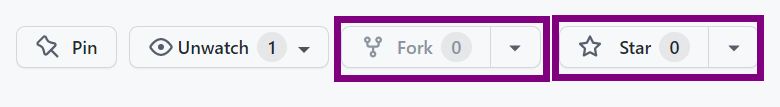
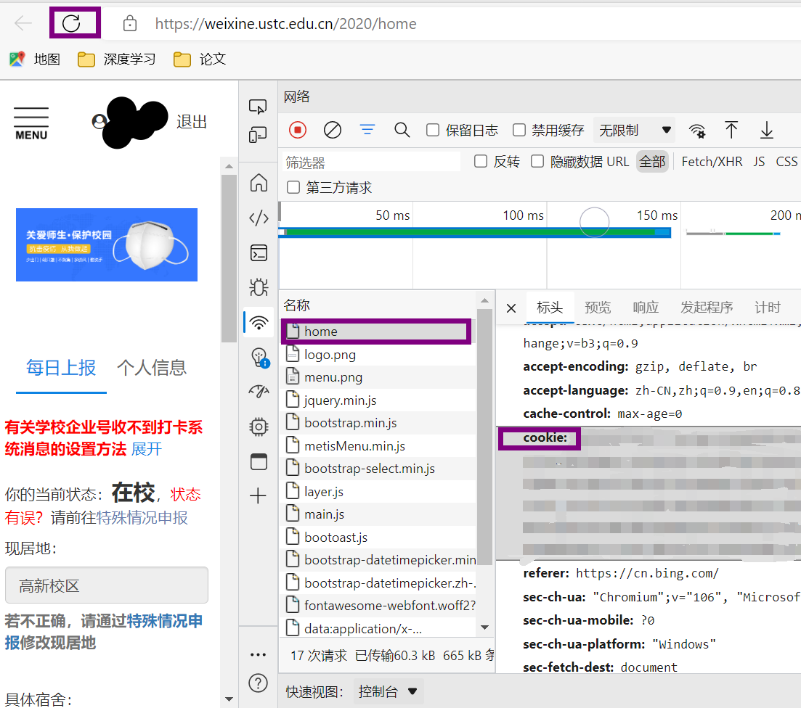
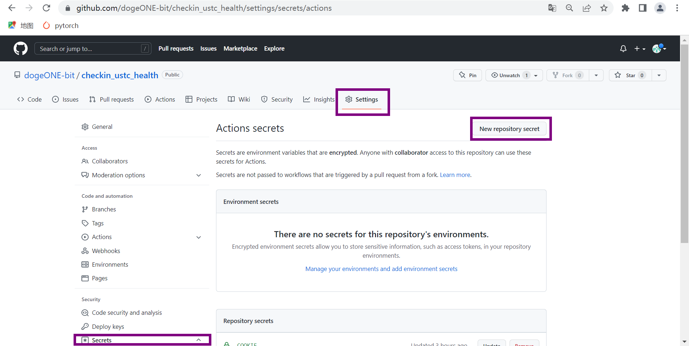
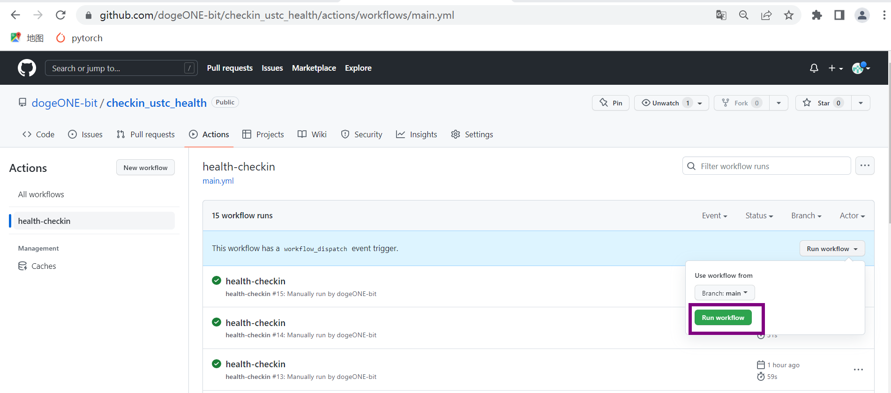

# checkin_ustc_health
## 简介
该项目能够实现中科大健康打开平台的自动签到

## 将项目fork到自己的仓库
1. 打开 https://github.com/dogeONE-bit/checkin_ustc_health
2. fork到自己的仓库 
   

## 获取cookie值，并填入secrets
1. 获取cookie值，进入这个中国科学技术大学健康打开平台，登陆完毕后按F12进入开发者工具，点击刷新获取home中的cookie值
   
2. 进入setting->secrets->action->new repository secret，name为COOKIE，value是咱们前面获得的cookie值
   

## 开启Action
   点击action->I understand my workflows, go ahead and enable them（绿色按钮）
   
## 测试运行
   点击run workflow
   
